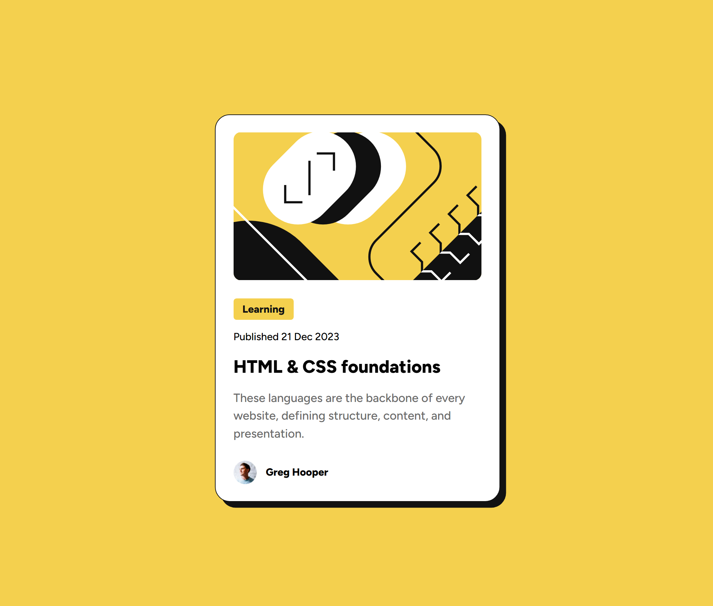

# Frontend Mentor - Blog preview card solution

This is a solution to the [Blog preview card challenge on Frontend Mentor](https://www.frontendmentor.io/challenges/blog-preview-card-ckPaj01IcS). Frontend Mentor challenges help you improve your coding skills by building realistic projects.

## Table of contents

- [Overview](#overview)
  - [Screenshot](#screenshot)
  - [Links](#links)
- [Built with](#built-with)
- [Author](#author)

## Overview

### Screenshot

### Links

- Solution URL: [https://www.frontendmentor.io/solutions/blog-preview-card-challenge-jhmkk673n4](https://www.frontendmentor.io/solutions/blog-preview-card-challenge-jhmkk673n4)
- Live Site URL: [https://dombuckdev.github.io/Blog-preview-card-challenge/](https://dombuckdev.github.io/Blog-preview-card-challenge/)

### Built with

- Semantic HTML5 markup
- CSS custom properties
- Flexbox
- Mobile-first workflow

## Author

- GitHub - [DomBuckDev](https://github.com/DomBuckDev)
- Frontend Mentor - [@DomBuckDev](https://www.frontendmentor.io/profile/DomBuckDev)
